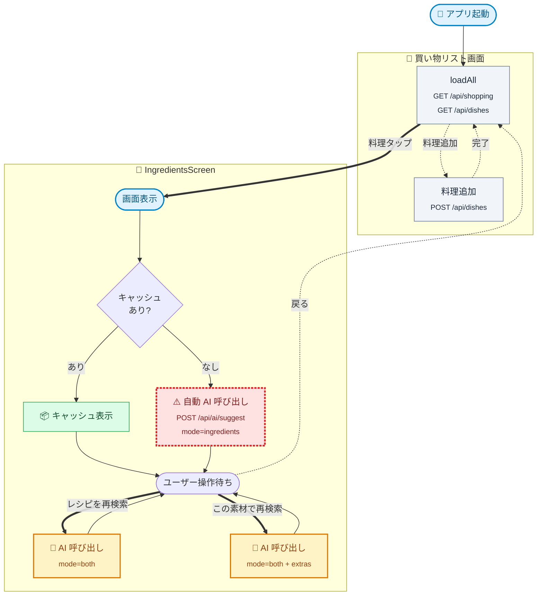
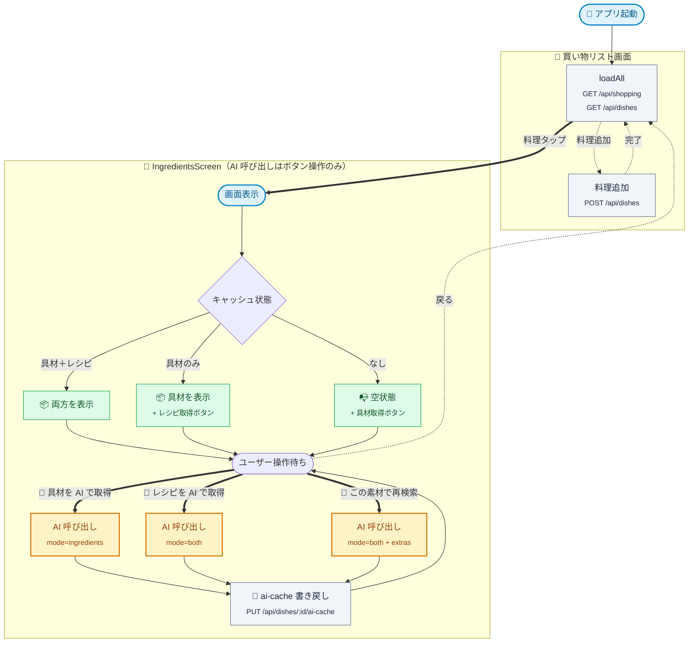

# 通信フロー / AI 呼び出し仕様

## 目的

お料理バスケットの **モバイルアプリ ⇄ サーバ** の通信フロー、特に Gemini API
を呼び出す経路（= 利用回数を消費する経路）を一枚絵で見えるようにし、
**ユーザーが明示的に意図した操作以外で AI 呼び出しを発生させない** ことを保証する。

最近のリファクタで「料理追加時の自動 AI 呼び出し」は廃止済み（[`00590e0`](#)）だが、
具材画面（IngredientsScreen）を開いた直後にキャッシュ未生成だと自動で具材取得が走る
動線が残っている。本ドキュメントで残課題を整理し、方針を確定させる。

---

## 関連エンドポイントと AI 呼び出しの関係

| エンドポイント | AI を呼ぶか | 備考 |
|---------------|-------------|------|
| `POST /api/auth/*` | ✗ | Magic Link / Google 認証 |
| `GET /api/shopping` | ✗ | 食材一覧 |
| `POST /api/shopping` | ✗ | 食材追加 |
| `PUT /api/shopping/:id` | ✗ | 食材更新（チェック含む） |
| `DELETE /api/shopping/checked` | ✗ | チェック済み一括削除 |
| `GET /api/shopping/suggestions` | ✗ | 過去頻度サジェスト（DB 集計） |
| `GET /api/dishes` | ✗ | 料理一覧 |
| `POST /api/dishes` | ✗ | **料理追加（AI を呼ばない）** |
| `PUT /api/dishes/:id` | ✗ | 料理名更新 |
| `DELETE /api/dishes/:id` | ✗ | 料理削除（ソフトデリート） |
| `PUT /api/dishes/:id/ai-cache` | ✗ | AI 結果のキャッシュ書き戻し |
| `POST /api/dishes/:id/items` | ✗ | 料理 ⇄ 食材リンク |
| `GET /api/saved-recipes` 系 | ✗ | レシピブック CRUD |
| **`POST /api/ai/suggest`** | **✓** | **唯一の AI 呼び出し口** |

サーバ側で AI を呼ぶ口は `POST /api/ai/suggest` の **1 つだけ**。
`optionalAuth + rateLimitAi` ミドルウェアを経由し、JST 日次のクォータを
`ai_quota` テーブルで管理する（未ログイン: ゲスト枠 / ログイン: ユーザー枠）。

---

## モバイルから `POST /api/ai/suggest` を呼ぶ経路（現状）

`mobile/src/components/dishes/IngredientsScreen.tsx` のみが AI 呼び出しをトリガする。
内部では `useShoppingStore.suggestIngredients()` → `suggestAi()` の順で呼ばれる。

| # | 起点 | mode | ユーザー意図 |
|---|------|------|-------------|
| A | IngredientsScreen 初回表示 (`useEffect`)<br/>`dish.ingredients_json` も `recipes_json` も無い場合のみ | `ingredients` | **暗黙**（画面遷移の副作用） |
| B | 「レシピを再検索」ボタン押下 | `both` | 明示 |
| C | 「この素材でレシピを再検索」ボタン押下 | `both` | 明示（買い物リスト由来の素材を必須として再検索） |

`(A)` だけが「画面を開いただけ」で発生する暗黙呼び出し。これが本タスクの整理対象。

---

## 現状フローチャート



**凡例**: 🟢 安全（AI 不要）／🟡 明示的な AI 呼び出し／🔴 暗黙の AI 呼び出し（本タスクで除去）

---

## 問題点

1. **「料理を作って中身を確認したい」だけのユーザーが残回数を消費する**
   - 料理追加 → 直後に料理タップで具材を見ようとする、という自然な動線で `(A)` の自動呼び出しが走る。
   - ゲスト枠（日次 3 回）だと、3 つ料理を追加して見るだけで枯渇する。

2. **画面遷移とコスト発生が結びついている**
   - 画面を開く＝コスト発生という暗黙ルールは、ユーザー体験的にも実装的にも見通しが悪い。
   - クォータエラー（429）が「ただ画面を開いただけ」で出ると、原因が分かりにくい。

3. **キャッシュ判定が「ingredients_json または recipes_json」**
   - `mode=ingredients` で取得すると `ingredients_json` のみ埋まる。
   - 次回開いた時には判定 truthy なのでキャッシュ表示される（OK）。
   - ただし「具材だけある／レシピは無い」状態が暗黙キャッシュとして残るため、ユーザーが
     レシピを見たいときの操作（明示ボタン押下）に強く依存する。これ自体は意図通りだが、
     画面側でのステータス表示は明確にしたい。

---

## 方針（確定したい仕様）

**原則: AI 呼び出しはユーザーの明示的なボタン操作によってのみ発生する。**

- 画面遷移・初期表示・データ再取得（pull-to-refresh, `loadAll`）では一切 AI を呼ばない。
- AI 呼び出しが起きうる UI には必ず「残り N 回」を併記し、消費が発生することを示す。
- キャッシュは表示専用。「再取得」は常に明示ボタン。

### 具材画面（IngredientsScreen）の振る舞い

| 状態 | 表示 | AI 呼び出し |
|-----|------|------------|
| キャッシュあり（具材／レシピ） | キャッシュをそのまま表示 | しない |
| キャッシュなし | 空状態 + 「具材を AI で取得（残り N 回）」ボタン | ボタン押下時のみ |
| 具材だけ取得済み（レシピ未取得） | 具材表示 + 「レシピを AI で取得（残り N 回）」ボタン | ボタン押下時のみ |
| ユーザーが買い物リストに素材を追加した状態 | 「この素材でレシピを再検索（残り N 回）」ボタン | ボタン押下時のみ |

### 料理一覧（買い物リスト）の振る舞い

- 変更なし。`loadAll` は AI を呼ばない。
- 料理アイコン（🧾 など）でキャッシュ済みかどうかを表現する仕様は維持する。

---

## 改善後フローチャート（提案）



すべての AI 呼び出しはユーザーのボタン押下が起点。暗黙呼び出し（赤ノード）は存在しない。

---

## サーバ側の不変条件（現状で OK）

- `POST /api/ai/suggest` は `optionalAuth + rateLimitAi` を必ず通る。
- 429 (`ai_quota_exceeded`) は `resetAt` を含む構造化レスポンスを返す。
- `X-AI-Remaining` ヘッダで残回数を返却し、クライアントは `ai-store` に保存する。
- 料理 CRUD（`POST /api/dishes` など）は AI を呼ばない。

サーバ側のミドルウェア構成は妥当。**改修はモバイル側のみで完結する。**

---

## 実装タスク（モバイル）

1. `IngredientsScreen` の初回 `useEffect` から `fetchSuggestions(undefined, 'ingredients')` を削除する。
2. キャッシュ状態に応じて表示する CTA を出し分ける:
   - キャッシュなし → 「具材を AI で取得（残り N 回）」
   - 具材のみ → 既存の「レシピを再検索」を「レシピを AI で取得（残り N 回）」に改名
   - 両方あり → 既存の「レシピを再検索」を維持
3. ボタンラベルに残回数（`useAiStore.remaining`）を併記する。残数 0 のときは押下時にクォータエラーをハンドリング（既存）。
4. 既存テスト（`mobile/__tests__/stores/`）の `suggestIngredients` 系を、`useEffect` 削除後の振る舞いに合わせて更新。

サーバ側の変更は不要。

---

## 実装タスク（ドキュメント環境 — Mermaid 描画）

本仕様書のフローチャートを「実際に図として」レンダリングするため、両ビューアに
Mermaid.js を組み込む。npm 依存追加は不要、CDN を `<script>` タグで読み込むだけ。

### Jekyll / GitHub Pages（`docs/`）

`docs/_layouts/default.html` の `</body>` 直前に追加:

```html
<script type="module">
  import mermaid from 'https://cdn.jsdelivr.net/npm/mermaid@11/dist/mermaid.esm.min.mjs';
  mermaid.initialize({ startOnLoad: true, theme: 'default', securityLevel: 'loose' });
</script>
```

`marked` ではなく kramdown を使うため、Mermaid ブロックは
`<pre><code class="language-mermaid">...</code></pre>` で出力される。
Mermaid v11 はこの形式を自動検出して描画する。

### dev-admin（`dev-admin/`）

`dev-admin/src/index.ts` の HTML ラッパ部分に同じ `<script>` を追加。
`marked` の出力する `<pre><code class="language-mermaid">` をそのまま Mermaid に渡す。

> 注意: `marked` の標準出力は `class="language-mermaid"` ではなく
> `class="language-mermaid hljs"` のような形になることがある。
> Mermaid v11 は `pre.mermaid` または `code.language-mermaid` を見つけるので問題なし。
> 念のためレンダ後に `document.querySelectorAll('pre > code.language-mermaid')` を
> Mermaid 形式に変換する初期化スニペットを 5 行ほど追加する。

### 検証

- ローカル Jekyll (`bundle exec jekyll serve`) と dev-admin (`./dev-admin.sh`) で
  `docs/specs/ai-call-flow.md` を開き、現状フロー / 改善後フローの両方が
  SVG として描画されることを確認する。
- subgraph・絵文字・`<sub>` タグが崩れないことを確認する。

---

## 受け入れ基準

### モバイル

- [ ] IngredientsScreen を **キャッシュなし** で開いても、自動で `POST /api/ai/suggest` が呼ばれない（DevTools / サーバログで確認）。
- [ ] キャッシュなし → 「具材を AI で取得」ボタンを押した場合のみ AI が呼ばれる。
- [ ] 具材のみキャッシュ済み → 「レシピを AI で取得」ボタンを押した場合のみ AI が呼ばれる。
- [ ] 「レシピを再検索」「この素材で再検索」など既存の明示操作は引き続き動作する。
- [ ] ボタンラベルに残回数が表示される（`remaining` が null のときは表示しない）。
- [ ] `mobile/__tests__/` の関連テストが通る。

### ドキュメント環境

- [ ] `docs/specs/ai-call-flow.md` が dev-admin で開いたとき、フローチャート 2 種が SVG として描画される。
- [ ] 同じ仕様書が GitHub Pages（または `bundle exec jekyll serve`）でも図として描画される。
- [ ] 既存の他の Markdown 仕様書（`shopping-list.md` 等）の表示が壊れない。

---

## 参考

- [docs/specs/shopping-list.md](shopping-list.html) — エンドポイント仕様
- [docs/specs/ai-features.md](ai-features.html) — AI 機能アイデア
- `server/src/middleware/rate-limit-ai.ts` — クォータ実装
- `server/src/routes/ai.ts` — `POST /api/ai/suggest`
- `mobile/src/components/dishes/IngredientsScreen.tsx` — 唯一の呼び出し起点
- `mobile/src/stores/shopping-store.ts` — `suggestIngredients` ロジック
